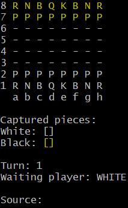

# ♛ GitBash Chess System

Content
=================
   * [About](#About)
   * [Prerequisites](#Prerequisites)
   * [Executing](#Executing)
   * [Technologies](#Technologies)

## About
Project created with the purpose of practicing the basic use of Java programming language. Featuring a GitBash Chess game developed during a Udemy Course. 

### Prerequisites
Before executing, you should have the following softwares installed:
- Git with GitBash.
- Java 11.

### Executing
```bash
# Clone this Repository
$ git clone https://github.com/thalesbarreto/chess-system-java.git
# Access the project folder using GitBash, and then the bin folder
$ cd bin
# Execute the Java application
$ java application/Main
# The program should start as below
```
<h1 align="center">
  
</h1>

### Technologies
- Java